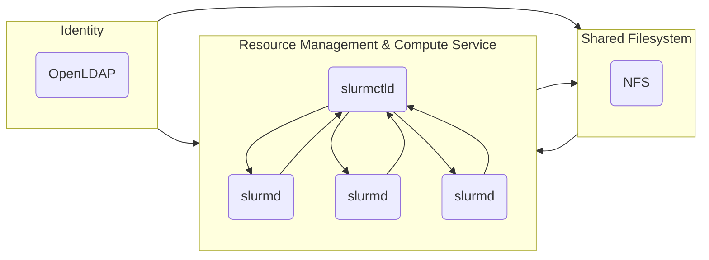

[//]: # "Copyright 2023 Jason C. Nucciarone"
[//]: # "See LICENSE file for licensing details."

# Using a mini-HPC cluster to test batch jobs

Testing applications intended to run on high-performance computing clusters can be a painful process, 
especially when you do not have access to the resources you need. Sometimes you just want to check if 
you have the right compile flag specified, if the script you wrote actually works, or if your 
application can successfully use multiple cores. One way to test your HPC software is by emulation; 
instead of wasting precious compute time on your bare-metal cluster, you use a mini-HPC cluster that 
provides the same functionality as the bare-metal cluster on a smaller scale.

Using cleantest, you can build yourself a mini-HPC cluster anywhere you need it, whether it be on your laptop
or a continuous integration pipeline runner. In this tutorial, you will learn how to build a mini-HPC cluster
and submit a test batch jobs to the cluster's resource manager/workload scheduler. Below is a diagram outlining
the architecture of the mini-HPC cluster that we are going to build with cleantest.



## Setting up the cleantest environment

### Test dependencies

This tutorial will be using the [LXD test environment provider](../user-guide/test-env-providers.md#lxd) to provide
the test environment instances that will compose the mini-HPC cluster. If you do not have LXD installed on your
system, please visit the [Installation guide](../user-guide/installation.md#lxd) for instructions on how to set up
LXD.

This tutorial will also being using the Jinja templating engine for rendering specific configuration files for the
services used inside the mini-HPC cluster. You can use the `pip` package manager to install Jinja on your system:

```shell
python3 -m pip install Jinja2
```

We will also be using `pytest` to run our "clean tests". `pytest` can be installed using `pip` as well:

```shell
python3 -m pip install pytest
```

### Required template files

The following Jinja template files are needed for rendering service configuration files. Please create a `templates`
directory in your current working directory and copy the templates to the newly created directory.

__sssd.conf.tmpl__

We will be using [sssd](https://ubuntu.com/server/docs/service-sssd) (System Security Services Daemon) to connect
clients to the mini-HPC cluster's identity service. This Jinja template will be used to render the _sssd.conf_ file
that will be used by the sssd service to locate the identity service.

```text
[sssd]
config_file_version = 2
domains = mini-hpc.org

[domain/mini-hpc.org]
id_provider = ldap
auth_provider = ldap
ldap_uri = ldap://{{ ldap_server_address }}
cache_credentials = True
ldap_search_base = dc=mini-hpc,dc=org
```

__slurm.conf.tmpl__

We will be using the [SLURM workload manager](https://slurm.schedmd.com/overview.html) to provide resource management,
workload scheduling, and compute service in the mini-HPC cluster. This Jinja template will be used to configure SLURM
after the controller and compute nodes have been created.

```text
SlurmctldHost={{ slurmctld_name }}({{ slurmctld_address }})
ClusterName=mini-hpc

AuthType=auth/munge
FirstJobId=65536
InactiveLimit=120
JobCompType=jobcomp/filetxt
JobCompLoc=/var/log/slurm/jobcomp
ProctrackType=proctrack/linuxproc
KillWait=30
MaxJobCount=10000
MinJobAge=3600
ReturnToService=0
SchedulerType=sched/backfill
SlurmctldLogFile=/var/log/slurm/slurmctld.log
SlurmdLogFile=/var/log/slurm/slurmd.log
SlurmctldPort=7002
SlurmdPort=7003
SlurmdSpoolDir=/var/spool/slurmd.spool
StateSaveLocation=/var/spool/slurm.state
SwitchType=switch/none
TmpFS=/tmp
WaitTime=30

# Node Configurations
NodeName={{ slurmd_0_name }} NodeAddr={{ slurmd_0_address }} CPUs=1 RealMemory=1000 TmpDisk=10000
NodeName={{ slurmd_1_name }} NodeAddr={{ slurmd_1_address }} CPUs=1 RealMemory=1000 TmpDisk=10000
NodeName={{ slurmd_2_name }} NodeAddr={{ slurmd_2_address }} CPUs=1 RealMemory=1000 TmpDisk=10000

# Partition Configurations
PartitionName=all Nodes={{ slurmd_0_name }},{{ slurmd_1_name }},{{ slurmd_2_name }} MaxTime=30 MaxNodes=3 State=UP
```

### Create the test file

Create the file _test_mini_hpc.py_ in your current working directory; this file is where we will write our test.
Once you have created _test_mini_hpc.py_, add the following lines to the top of the file:

```python
#!/usr/bin/env python3

"""Test batch job using mini-HPC cluster created with cleantest."""

import json
import os
import pathlib
from io import StringIO

from jinja2 import Environment, FileSystemLoader

from cleantest.control.hooks import StopEnvHook
from cleantest.control.lxd import InstanceConfig
from cleantest.data import File
from cleantest.provider import lxd, LXDArchon

root = pathlib.Path(os.path.dirname(os.path.realpath(__file__)))
templates = Environment(loader=FileSystemLoader(root / "templates"))

# Where the testlet will be added.
...


def test_mini_hpc() -> None:
    """Test batch job inside mini-hpc cluster."""
    archon = LXDArchon()
    archon.config.register_hook(
        StopEnvHook(name="get_result", download=[File("/tmp/result", root / "result")])
    )
    placeholder = archon.config.get_instance_config("ubuntu-jammy-amd64").dict()
    placeholder["name"] = "mini-hpc-sm"
    archon.config.add_instance_config(
        InstanceConfig(
            config={
                "limits.cpu": "1",
                "limits.memory": "8GB",
                "security.privileged": "true",
                "raw.apparmor": "mount fstype=nfs*, mount fstype=rpc_pipefs,",
            },
            **placeholder,
        )
    )

    # Where most of the code snippets will be appended 
    # for creating the mini-HPC cluster.
    ...
```

These imports/variable declarations at the beginning of the test file will be used throughout the code snippets in
the rest of this tutorial.

Inside our test function, we instantiate an instance of `LXDArchon` that will be used to
control the LXD test environment provider. We also define a stop environment hook that will be used to retrieve
the result of our test batch job. Lastly, we create a custom test environment instance configuration. This
configuration will have the necessary privileges set so that we do not eat all of your workstation's resources
as well as enabling support for NFS mounts inside the test environment instances.

## Configuring the identity service

To start, we will be configuring an identity service for our mini-HPC cluster. We cannot let user `root` be the 
primary user of our mini-HPC cluster; that would create a disaster. To prevent the mini-HPC cluster from going 
up into flames, we are going to use [slapd](https://manpages.ubuntu.com/manpages/jammy/en/man8/slapd.8.html)
(Stand-alone LDAP Daemon) to provide the identity service for our cluster.

### Provision script for `ldap-0`

cleantest has a built-in provisioning mechanism for test environment instances. You can write custom Python scripts
that use utilities provided by cleantest to set up the test environment instance how you like. Below is the provision
script that we will use to provision the `ldap-0` instance in our mini-HPC cluster. Save the provision script to the
file _ldap_provision_script.py_ in your current working directory.

```python
#!/usr/bin/env python3
# Copyright 2023 Jason C. Nucciarone
# See LICENSE file for licensing details.

"""Provision LDAP server nodes."""

import pathlib
import tempfile
import textwrap

from cleantest.utils import apt, systemd, run

# Define resources needed to set up LDAP.
slapd_preseed = textwrap.dedent(
    """
    slapd slapd/no_configuration boolean false
    slapd slapd/domain string mini-hpc.org
    slapd shared/organization string mini-hpc
    slapd slapd/password1 password test
    slapd slapd/password2 password test
    slapd slapd/purge_database boolean true
    slapd slapd/move_old_database boolean true
    """
).strip("\n")
default_ldif = textwrap.dedent(
    """
    dn: ou=People,dc=mini-hpc,dc=org
    objectClass: organizationalUnit
    ou: People
    
    dn: ou=Groups,dc=mini-hpc,dc=org
    objectClass: organizationalUnit
    ou: Groups
    
    dn: uid=nucci,ou=People,dc=mini-hpc,dc=org
    uid: nucci
    objectClass: inetOrgPerson
    objectClass: posixAccount
    cn: nucci
    sn: nucci
    givenName: nucci
    mail: nucci@example.com
    userPassword: test
    uidNumber: 10000
    gidNumber: 10000
    loginShell: /bin/bash
    homeDirectory: /home/nucci
    
    dn: cn=nucci,ou=Groups,dc=mini-hpc,dc=org
    cn: nucci
    objectClass: posixGroup
    gidNumber: 10000
    memberUid: nucci
    
    dn: cn=research,ou=Groups,dc=mini-hpc,dc=org
    cn: research
    objectClass: posixGroup
    gidNumber: 10100
    memberUid: nucci
    """
).strip("\n")

# Set up slapd service.
apt.update()
apt.install("slapd", "ldap-utils", "debconf-utils")
with tempfile.NamedTemporaryFile() as preseed, tempfile.NamedTemporaryFile() as ldif:
    pathlib.Path(preseed.name).write_text(slapd_preseed)
    pathlib.Path(ldif.name).write_text(default_ldif)
    results = run(
        f"debconf-set-selections < {preseed.name}",
        "dpkg-reconfigure -f noninteractive slapd",
        (
            "ldapadd -x -D cn=admin,dc=mini-hpc,dc=org -w "
            f"test -f {ldif.name} -H ldap:///"
        ),
    )
    for result in results:
        assert result.exit_code == 0

systemd.restart("slapd")
```

The provision script works through the following steps:

1. Import the `apt`, `systemd`, and `run` utilities for interfacing with the APT package manager and systemd on the 
    instance, and executing shell commands respectively.
2. Define a preseed file that will be used by `debconf-set-selections` to configure the slapd service on the instance.
3. Define a ldif (LDAP Data Interchange Format) file that will be used to create our test user and group.
4. Update APT cache and install `slapd`, `ldap-utils`, and `debconf-utils`.
5. Configure slapd service using `debconf-set-selections` and add test user and group to the LDAP server.
6. Restart slapd so that new configurations will be set.

### Use cleantest archon to create `ldap-0`

Now that we have our provision script _ldap_provision_script.py_ written, use the following block of code
to add the instance `ldap-0` to our LXD test environment provider:

```python
archon.add(
    "ldap-0",
    image="mini-hpc-sm",
    provision_script=root / "ldap_provision_script.py",
)
```

The provision script will be injected into `ldap-0` and executed after the instance becomes active.

## Setting up the shared filesystem

We will be using [NFS](https://en.wikipedia.org/wiki/Network_File_System) (Network File System) to provide the
shared filesystem in the mini-HPC cluster. Many compute instances are generally operating on the same set of data
across the cluster, so the compute nodes all need access to the same data. Using NFS, we can ensure that each
compute instance has access to the same file and/or directories. 

### Provision script for `nfs-0`

With the `ldap-0` instance created, create the provision script _nfs_provision_script.py_ in your current working
directory and add the following code block to the file:

```python
#!/usr/bin/env python3
# Copyright 2023 Jason C. Nucciarone
# See LICENSE file for licensing details.

"""Provision NFS server nodes."""

import pathlib
import textwrap

from cleantest.utils import apt, systemd, run

# Define resources needed to set up nfs-kernel-server.
default_exports = textwrap.dedent(
    """
    /srv     *(ro,sync,subtree_check)
    /home    *(rw,sync,no_subtree_check)
    /data    *(rw,sync,no_subtree_check,no_root_squash)
    /opt     *(rw,sync,no_subtree_check,no_root_squash)
    """
).strip("\n")

# Set up SSSD service.
apt.update()
apt.install("nfs-kernel-server", "sssd-ldap")
for result in run(
    "mv /root/.init/sssd.conf /etc/sssd/sssd.conf",
    "chmod 0600 /etc/sssd/sssd.conf",
    "pam-auth-update --enable mkhomedir",
):
    assert result.exit_code == 0

systemd.restart("sssd")

# Set up NFS kernel server.
for result in run(
    "mkdir -p /data/nucci",
    "mkdir -p /home/nucci",
    "chown -R nucci:nucci /data/nucci",
    "chown -R nucci:nucci /home/nucci",
    "chmod 0755 /data",
    "chmod -R 0750 /data/nucci",
    "chmod -R 0740 /home/nucci",
    "ln -s /data/nucci /home/nucci/data",
):
    assert result.exit_code == 0

pathlib.Path("/etc/exports").write_text(default_exports)
for result in run("exportfs -a"):
    assert result.exit_code == 0

systemd.restart("nfs-kernel-server")
```

???+ note "Connecting to the LDAP server on `ldap-0` using sssd"

    Notice how in _nfs_provision_script.py_ when are configuring the sssd service, we are first moving a sssd.conf
    file from `/root/.init/sssd.conf` to `/etc/sssd/sssd.conf`? You may be wondering "how did that file get there?"
    Worry not! In the [next section](#use-cleantest-archon-to-create-nfs-0), we will be generating that sssd.conf
    file using a Jinja template and uploading to `nfs-0` as a "provisioning resource."

This script will work through the following the steps to configure the NFS server that will provide the shared
filesystem for the mini-HPC cluster:

1. Import `apt`, `systemd`, and `run` utilities for interfacing with the APT package manager and systemd on the 
    instance, and executing shell commands respectively.
2. Define the _exports_ file that will be used to tell the NFS kernel server which directories to export.
3. Update the APT cache and install `nfs-kernel-server` and `sssd-ldap` for running the NFS server and connecting to
    the LDAP server respectively.
4. Connect to the LDAP server on `ldap-0` using sssd.
5. Set up the test user's home and data directories.
6. Share the `/data` and `/home` directories across the network.
7. Restart the `nfs-kernel-service` so the new _/etc/exports_ file takes effect.

### Use cleantest archon to create `nfs-0`

Now with our _nfs_provision_script.py_ file created, use the following block of code to add the `nfs-0` 
instance to our LXD test environment provider.

```python
sssd_conf = StringIO(
    templates.get_template("sssd.conf.tmpl").render(
        ldap_server_address=archon.get_public_address("ldap-0")
    )
)
archon.add(
    "nfs-0",
    image="mini-hpc-sm",
    provision_script=root / "nfs_provision_script.py",
    resources=[File(sssd_conf, "/root/.init/sssd.conf")],
)
```

The provision script and generated sssd.conf file will be injected into `nfs-0` after the instance becomes active.

## Starting the SLURM cluster

SLURM is one of the most popular open-source workload managers out there for HPC. SLURM scales very well, so we
can use it inside the mini-HPC cluster even if SLURM is meant to used with multi-thousand node clusters.

### Provision script for `slurmctld-0`

Now that we have both the `ldap-0` and `nfs-0` instances created, it is time to provision to controller server
`slurmctld-0` for the mini-HPC cluster. Create the file _slurmctld_provision_script.py_ in your current working
directory and copy the following code block to it:

```python
#!/usr/bin/env python3
# Copyright 2023 Jason C. Nucciarone
# See LICENSE file for licensing details.

"""Provision slurmctld nodes."""

import pathlib
import json
from io import StringIO

from cleantest.utils import apt, systemd, run

# Set up SSSD service.
apt.update()
apt.install("slurmctld", "nfs-common", "sssd-ldap")
for result in run(
    "mv /root/.init/sssd.conf /etc/sssd/sssd.conf",
    "chmod 0600 /etc/sssd/sssd.conf",
    "pam-auth-update --enable mkhomedir",
):
    assert result.exit_code == 0

systemd.restart("sssd")

# Set up NFS mount.
nfs_ip = json.load(StringIO(pathlib.Path("/root/.init/nfs-0").read_text()))
for result in run(
    f"mount {nfs_ip['nfs-0']}:/home /home",
    "mkdir -p /data",
    f"mount {nfs_ip['nfs-0']}:/data /data",
):
    assert result.exit_code == 0
```

???+ note "Mounting directories shared by `nfs-0` and connecting to LDAP server on `ldap-0`"

    Notice how like when we provisioned the `nfs-0` instance, we used a "provisioning resource" to connect the
    sssd service to the LDAP server? In the above provisioning script for `slurmctld-0`, we use the same mechanism
    for mounting the shared directories on `nfs-0`. We will create this `/root/.init/nfs-0` resource in 
    [the section](#use-cleantest-archon-to-create-slurmctld-0) about creating the `slurmctld-0` instance.

This script will work through the following steps to configure the controller service for the mini-HPC cluster.
We will be starting the control server manually rather than having the provision script start it for us:

1. Import `apt`, `systemd`, and `run` utilities for interfacing with the APT package manager and systemd on the 
    instance, and executing shell commands respectively.
2. Update the APT cache and install `slurmctld`, `nfs-common`, `sssd-ldap` for running the controller server,
    mounting the shared directories, and connecting to the LDAP server respectively.
3. Connect to the LDAP server running on `ldap-0` using sssd.
4. Mount the shared directories exported by the NFS server running on `nfs-0`.

### Provision script for `slurmd-{0,1,2}`

We can also provision the compute nodes alongside the controller server `slurmctld-0`. Create the file
_slurmd_provision_script.py_ in your current working directory and copy the following code block to it:

```python
#!/usr/bin/env python3
# Copyright 2023 Jason C. Nucciarone
# See LICENSE file for licensing details.

"""Provision slurmd nodes."""

import json
import pathlib
from io import StringIO

from cleantest.utils import apt, systemd, run

# Set up SSSD service.
apt.update()
apt.install("slurmd", "nfs-common", "sssd-ldap")
for result in run(
    "mv /root/.init/sssd.conf /etc/sssd/sssd.conf",
    "chmod 0600 /etc/sssd/sssd.conf",
    "pam-auth-update --enable mkhomedir",
):
    assert result.exit_code == 0

systemd.restart("sssd")

# Set up NFS mount.
nfs_ip = json.load(StringIO(pathlib.Path("/root/.init/nfs-0").read_text()))
for result in run(
    f"mount {nfs_ip['nfs-0']}:/home /home",
    "mkdir -p /data",
    f"mount {nfs_ip['nfs-0']}:/data /data",
):
    assert result.exit_code == 0

# Set up munge key.
for result in run(
    "mv /root/.init/munge.key /etc/munge/munge.key",
    "chown munge:munge /etc/munge/munge.key",
    "chmod 0600 /etc/munge/munge.key",
):
    assert result.exit_code == 0

systemd.restart("munge")
```

???+ note "Setting up MUNGE authentication service"

    Similar to how `nfs-0` and `slurmctld-0` are provisioned, the slurmd instances also use "provisioning resources."
    However, unlike those instances, the slurmd instances require a MUNGE key from the `slurmctld-0`; MUNGE is the
    authentication service that the SLURM workload manager uses to verify nodes in SLURM cluster. 
    [The section](#pull-munge-key-from-slurmctld-0-and-create-slurmd-012) on
    creating the slurmd instances will show you how to pull resources from other instances.

This script will work through the following steps to configure the compute service for the mini-HPC cluster.
We will be starting the compute servers manually rather than having the provision script start it for us:

1. Import `apt`, `systemd`, and `run` utilities for interfacing with the APT package manager and systemd on the 
    instance, and executing shell commands respectively.
2. Update the APT cache and install `slurmd`, `nfs-common`, `sssd-ldap` for running the compute server,
    mounting the shared directories, and connecting to the LDAP server respectively.
3. Connect to the LDAP server running on `ldap-0` using sssd.
4. Mount the shared directories exported by the NFS server running on `nfs-0`.
5. Set up MUNGE key pulled from `slurmctld-0` instance.

### Use cleantest archon to create `slurmctld-0`

Now with our _slurmctld_provision_script.py_ file created, use the following block of code to add the `slurmctld-0` 
instance to our LXD test environment provider.

```python
nfs_ip = json.dumps({"nfs-0": str(archon.get_public_address("nfs-0"))})
archon.add(
    "slurmctld-0",
    image="mini-hpc-sm",
    provision_script=root / "slurmctld_provision_script.py",
    resources=[
        File(sssd_conf, "/root/.init/sssd.conf"),
        File(StringIO(nfs_ip), "/root/.init/nfs-0"),
    ],
)
```

The provision script, generated sssd.conf and generated nfs-0 files will be injected into `slurmctld-0` after the
instance becomes active.

### Pull MUNGE key from `slurmctld-0` and create `slurmd-{0,1,2}`

Using our other provisioning script _slurmd_provision_script.py_, use the following code block to pull the 
_munge.key_ file from `slurmctld-0` and create the instance `slurmd-0`, `slurmd-1`, and `slurmd-2`.

```python
archon.pull(
    "slurmctld-0", data_obj=[File("/etc/munge/munge.key", root / "munge.key")]
)
archon.add(
    ["slurmd-0", "slurmd-1", "slurmd-2"],
    image="mini-hpc-sm",
    provision_script=root / "slurmd_provision_script.py",
    resources=[
        File(sssd_conf, "/root/.init/sssd.conf"),
        File(StringIO(nfs_ip), "/root/.init/nfs-0"),
        File(root / "munge.key", "/root/.init/munge.key"),
    ],
)
```

The provision script, generated sssd.conf file, generated nfs-0 file, and pulled munge.key file will be 
injected into `slurmd-0`, `slurmd-1`, and `slurmd-2` after the instance becomes active.

### Sync slurm.conf across `slurmctld-0` and `slurmd-{0,1,2}` and start SLURM services

Now that `slurmctld-0`, `slurmd-0`, `slurmd-1`, and `slurmd-2` have been created, we can now use the following code
block to start the SLURM cluster:

```python
slurm_node_info = {
    "slurmctld_name": "slurmctld-0",
    "slurmctld_address": archon.get_public_address("slurmctld-0"),
    "slurmd_0_name": "slurmd-0",
    "slurmd_0_address": archon.get_public_address("slurmd-0"),
    "slurmd_1_name": "slurmd-1",
    "slurmd_1_address": archon.get_public_address("slurmd-1"),
    "slurmd_2_name": "slurmd-2",
    "slurmd_2_address": archon.get_public_address("slurmd-2"),
}
slurm_conf = StringIO(
    templates.get_template("slurm.conf.tmpl").render(**slurm_node_info)
)
for node in ["slurmctld-0", "slurmd-0", "slurmd-1", "slurmd-2"]:
    archon.push(node, data_obj=[File(slurm_conf, "/etc/slurm/slurm.conf")])
archon.execute("slurmctld-0", command="systemctl start slurmctld")
archon.execute(
    ["slurmd-0", "slurmd-1", "slurmd-2"], command="systemctl start slurmd"
)
```

This code block will pull the IPv4 addresses of `slurmctld-0`, `slurmd-0`, `slurmd-1`, and `slurmd-2`,
generate the slurm.conf from a Jinja template, push slurm.conf into all the slurm instances, and then
start each slurm service.

## Write a testlet to submit test batch job

Congratulations, we finally have all the code that we need to create the mini-HPC cluster when we go to run our
test. Now it is time to write the testlet. In the code block below, `@lxd.target("...")` is used to target a
specific test environment instance rather than creating a unique instance for the testlet:

```python3
@lxd.target("slurmctld-0")
def run_job():
    import os
    import pathlib
    import shutil
    import textwrap
    from time import sleep

    from cleantest.utils import run

    tmp_dir = pathlib.Path("/tmp")
    (tmp_dir / "research.submit").write_text(
        textwrap.dedent(
            """
            #!/bin/bash
            #SBATCH --job-name=research
            #SBATCH --partition=all
            #SBATCH --nodes=1
            #SBATCH --ntasks-per-node=1
            #SBATCH --cpus-per-task=1
            #SBATCH --mem=500mb
            #SBATCH --time=00:00:30
            #SBATCH --error=research.err
            #SBATCH --output=research.out
            
            echo "I love doing research!"
            """
        ).strip("\n")
    )

    # Set user to test cluster user nucci.
    os.setuid(10000)
    os.chdir("/home/nucci")
    for result in run(
        f"cp {(tmp_dir / 'research.submit')} .",
        "sbatch research.submit",
    ):
        assert result.exit_code == 0
    sleep(60)
    shutil.copy("research.out", (tmp_dir / "result"))
```

??? warning "A warning about using cleantest with the SLURM workload manager"

    One thing to note about the SLURM workload manager is that it does not let user `root` submit jobs to
    the scheduler (for obvious reasons). Unfortunately, cleantest currently only allows for testlets to be
    run as user `root`. To get around this limitation, we can use Python's `os` module to change to our test
    user, but we cannot change back to user `root` after the switch. You should have your "power-user" operations
    taken care of before switching to the test user.


## Bringing it all together

Your completed test file _test_mini_hpc.py_ should look like the following:

```python
#!/usr/bin/env python3

"""Test batch job using mini-HPC cluster created with cleantest."""

import json
import os
import pathlib
from io import StringIO

from jinja2 import Environment, FileSystemLoader

from cleantest.control.hooks import StopEnvHook
from cleantest.control.lxd import InstanceConfig
from cleantest.data import File
from cleantest.provider import lxd, LXDArchon

root = pathlib.Path(os.path.dirname(os.path.realpath(__file__)))
templates = Environment(loader=FileSystemLoader(root / "templates"))


@lxd.target("slurmctld-0")
def run_job():
    import os
    import pathlib
    import shutil
    import textwrap
    from time import sleep

    from cleantest.utils import run

    tmp_dir = pathlib.Path("/tmp")
    (tmp_dir / "research.submit").write_text(
        textwrap.dedent(
            """
            #!/bin/bash
            #SBATCH --job-name=research
            #SBATCH --partition=all
            #SBATCH --nodes=1
            #SBATCH --ntasks-per-node=1
            #SBATCH --cpus-per-task=1
            #SBATCH --mem=500mb
            #SBATCH --time=00:00:30
            #SBATCH --error=research.err
            #SBATCH --output=research.out
            
            echo "I love doing research!"
            """
        ).strip("\n")
    )

    # Set user to test cluster user nucci.
    os.setuid(10000)
    os.chdir("/home/nucci")
    for result in run(
        f"cp {(tmp_dir / 'research.submit')} .",
        "sbatch research.submit",
    ):
        assert result.exit_code == 0
    sleep(60)
    shutil.copy("research.out", (tmp_dir / "result"))


def test_lxd_archon_local() -> None:
    """Test LXDArchon against local LXD cluster."""
    archon = LXDArchon()
    archon.config.register_hook(
        StopEnvHook(name="get_result", download=[File("/tmp/result", root / "result")])
    )
    placeholder = archon.config.get_instance_config("ubuntu-jammy-amd64").dict()
    placeholder["name"] = "mini-hpc-sm"
    archon.config.add_instance_config(
        InstanceConfig(
            config={
                "limits.cpu": "1",
                "limits.memory": "8GB",
                "security.privileged": "true",
                "raw.apparmor": "mount fstype=nfs*, mount fstype=rpc_pipefs,",
            },
            **placeholder,
        )
    )
    archon.add(
        "ldap-0",
        image="mini-hpc-sm",
        provision_script=root / "ldap_provision_script.py",
    )
    sssd_conf = StringIO(
        templates.get_template("sssd.conf.tmpl").render(
            ldap_server_address=archon.get_public_address("ldap-0")
        )
    )
    archon.add(
        "nfs-0",
        image="mini-hpc-sm",
        provision_script=root / "nfs_provision_script.py",
        resources=[File(sssd_conf, "/root/.init/sssd.conf")],
    )
    nfs_ip = json.dumps({"nfs-0": str(archon.get_public_address("nfs-0"))})
    archon.add(
        "slurmctld-0",
        image="mini-hpc-sm",
        provision_script=root / "slurmctld_provision_script.py",
        resources=[
            File(sssd_conf, "/root/.init/sssd.conf"),
            File(StringIO(nfs_ip), "/root/.init/nfs-0"),
        ],
    )
    archon.pull(
        "slurmctld-0", data_obj=[File("/etc/munge/munge.key", root / "munge.key")]
    )
    archon.add(
        ["slurmd-0", "slurmd-1", "slurmd-2"],
        image="mini-hpc-sm",
        provision_script=root / "slurmd_provision_script.py",
        resources=[
            File(sssd_conf, "/root/.init/sssd.conf"),
            File(StringIO(nfs_ip), "/root/.init/nfs-0"),
            File(root / "munge.key", "/root/.init/munge.key"),
        ],
    )
    slurm_node_info = {
        "slurmctld_name": "slurmctld-0",
        "slurmctld_address": archon.get_public_address("slurmctld-0"),
        "slurmd_0_name": "slurmd-0",
        "slurmd_0_address": archon.get_public_address("slurmd-0"),
        "slurmd_1_name": "slurmd-1",
        "slurmd_1_address": archon.get_public_address("slurmd-1"),
        "slurmd_2_name": "slurmd-2",
        "slurmd_2_address": archon.get_public_address("slurmd-2"),
    }
    slurm_conf = StringIO(
        templates.get_template("slurm.conf.tmpl").render(**slurm_node_info)
    )
    for node in ["slurmctld-0", "slurmd-0", "slurmd-1", "slurmd-2"]:
        archon.push(node, data_obj=[File(slurm_conf, "/etc/slurm/slurm.conf")])
    archon.execute("slurmctld-0", command="systemctl start slurmctld")
    archon.execute(
        ["slurmd-0", "slurmd-1", "slurmd-2"], command="systemctl start slurmd"
    )
    for name, result in run_job():
        assert "I love doing research!" in pathlib.Path(root / "result").read_text()
    (root / "munge.key").unlink(missing_ok=True)
    (root / "result").unlink(missing_ok=True)
    archon.execute(
        ["slurmctld-0", "slurmd-0", "slurmd-1", "slurmd-2"],
        command=f"umount /home /data",
    )
    archon.destroy()
```

Do not forget to add the bottom part here that evaluates the result of the testlet! After the evaluation, some
basic cleanup is also performed so that the mini-HPC cluster does not continue to use your workstation's resources
after the test has completed. Now use `pytest` to run your "clean test"!

```shell
pytest test_mini_hpc.py
```

Now sit back, relax, and wait for your test to complete! You can watch the following video to get an idea
of what cleantest is doing "under the hood" on your system to run the test:

<p align="center">
  <iframe 
    width="620" height="375" src="https://www.youtube.com/embed/UXQ9WHRiBfo" 
    title="mini-hpc cluster demo video" frameborder="0" 
    allow="accelerometer; autoplay; clipboard-write; encrypted-media; gyroscope; picture-in-picture; web-share" 
    allowfullscreen>
  </iframe>
</p>


## Where to go from here

This was quite a long tutorial, so make sure to grant yourself a well-earned coffee break! 

If you are interested in learning more about the underpinnings of a mini-HPC cluster, check out my 
[intro to open-source HPC workshop](https://nuccitheboss.github.io/hpc-workshop/) that I gave at the 2022 Ubuntu 
Summit in Prague. My workshop will take your through building your own mini-HPC cluster manually, and it takes you
further than just setting up the infrastructure such as building containers and deploying your own software stack.

If you want to sink your teeth further into cleantest, I suggest reading more of the tutorials or heading over
onto the [User Guide](../user-guide/installation.md) page to learn about what cleantest is capable of!
