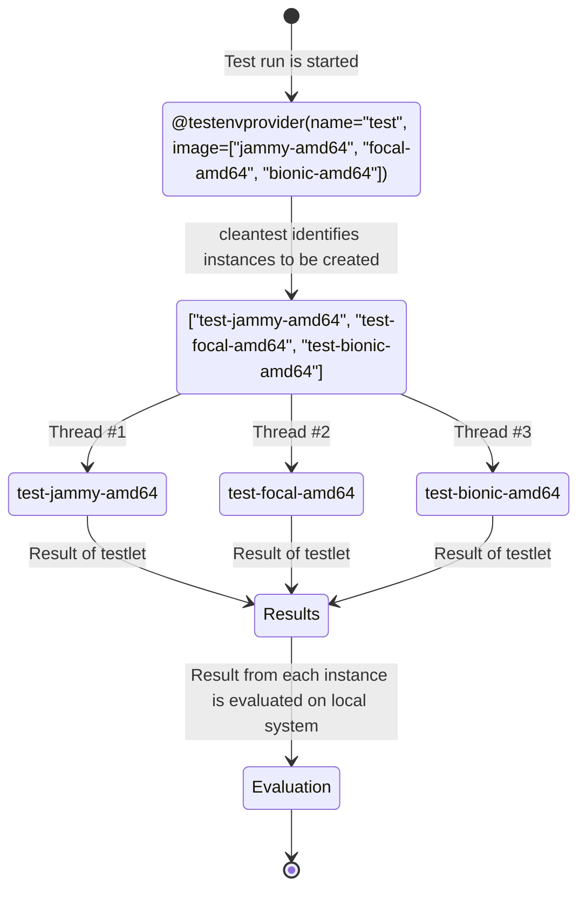

[//]: # "Copyright 2023 Jason C. Nucciarone"
[//]: # "See LICENSE file for licensing details."

# Running tests in parallel

cleantest has the ability to run test environment instances in parallel to increase the efficiency of test runs.
You can define the number of threads to use when running test environment instances in parallel as either arguments to 
the test environment provider, or you can pass the number of threads to use when the test run is started using 
the `CLEANTEST_NUM_THREADS` environment variable:

```shell
CLEANTEST_NUM_THREADS=$(nproc) pytest cleantest_test_suite.py
```

This is the flow that cleantest follows when parallel testing is enabled for a testlet. Rather than proceeding through
each image sequentially to bring up a test environment instance and inject the testlet, each instance is brought up
independently in a separate thread and the testlet is injected there. cleantest blocks until all threads have 
completed. 



cleantest's built-in parallel testing support is best suited for spread testing; you have a testlet
that you need to test across different types of test environment instances. For testing multiple testlets in parallel,
you need to use one of Python's many parallel computing libraries, or third-party tool such as xargs or GNU parallel.

## Examples

### LXD

```python
#!/usr/bin/env python3

"""Parallel testing example using LXD as test environment provider."""

from cleantest.control import Configure
from cleantest.hooks import StartEnvHook
from cleantest.data.pkg import Pip
from cleantest.provider import lxd


@lxd(
    image=["ubuntu-jammy-amd64", "ubuntu-focal-amd64", "ubuntu-bionic-amd64"],
    preserve=False,
    parallel=True,
    num_threads=3,
)
def install_tabulate():
    import sys

    try:
        from tabulate import tabulate

        print("tabulate is installed.", file=sys.stdout)
    except ImportError:
        print("Failed to import tabulate package.", file=sys.stderr)
        sys.exit(1)

    sys.exit(0)


def test_parallel_lxd(clean_slate) -> None:
    config = Configure("lxd")
    start_hook = StartEnvHook(name="pip_injection", packages=[Pip(packages="tabulate")])
    config.register_hook(start_hook)
    for name, result in install_tabulate():
        try:
            assert result.exit_code == 0
        except AssertionError:
            raise Exception(f"{name} failed. Result: {result}")
```